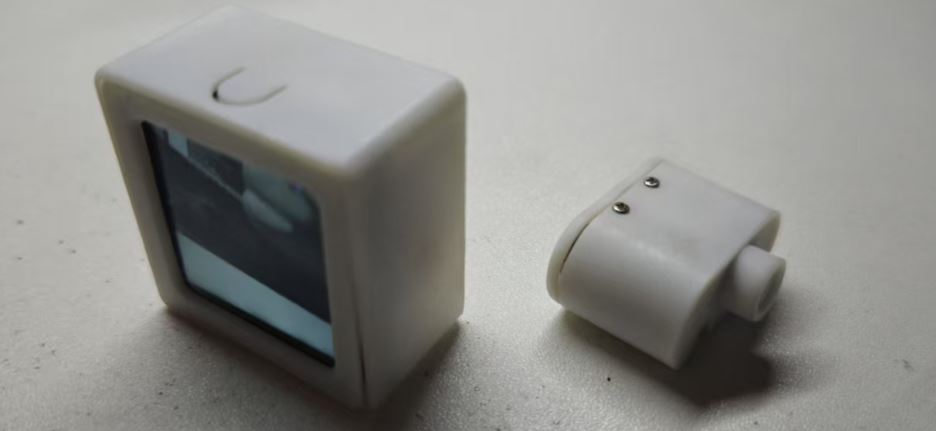

# 蓝牙图像传输 | [Ble video transmission](./README-EN.md)

## 1 项目概述
现实应用中，无线视频传输一般使用的是带宽比较大的WIFI来实现，那么对于带宽非常有限的蓝牙来说是否有传输视频的可能性。其实23年上市的insta 360 go3已经给了我们答案：这个想法是可行的。
受insta 360 go3的启发，我开始了这个项目。本项目基于ESP32-S3实现。传输图像分辨率为240x240。

## 2 功能介绍
### 2.1 发送端
* 系统启动后初始化摄像头和开启ble gatt server
* 按下按键后指示灯开始显示工作状态
* 指示灯有红绿蓝三种颜色，其中绿色表示电量高，蓝色表示电量中等，红色表示电量低
* 指示灯慢闪表示发送端蓝牙没有被连接，快闪表示已经被连接了
* 再次按下按键后关闭指示灯
* 发送端放到充电仓中后会常亮显示表示正在充电(此时无法通过按键熄灭)

### 2.2 接收端
* 系统启动后会初始化屏幕和自动搜索ble gatt server
* 搜索到server后会自动连接和接收图像数据
* 按下按键后会开启屏幕背光，显示画面
* 屏幕右上角有电池图标显示电量
* 接入充电线后电池图标会显示正在充电中

## 3 原理解析
* 蓝牙的传输基于GATT的NOTIFY实现，最大传输速度在90KB/s左右
* 摄像头使用的OV2640，在图像格式配置为JPEG，分辨率为240x240
* JPEG解码库使用的esp_jpeg

### 如果对本项目有任何疑问，欢迎在issue中与我讨论。
